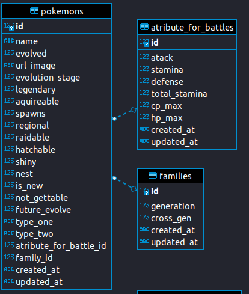

## Desafio RedFoxTech

Esse desafio consiste em importar os dados do Pokemon Go, que estão no excel, e criar uma API. Para mais detalhes acesse <a href="https://github.com/RedFoxTech/vaga-backend-teste">link</a>.

## Requisitos necessários

Antes de executar o projeto sua máquina deve conter alguns programas instalados, aqui estão eles.

 - Git
 - Node
 - Ruby
 - Ruby on rails

No site <a href="https://gorails.com/setup/ubuntu/21.04">go rails</a> contém o passo a passo para instalar tudo o que é necessário.

## Executando o projeto

Clonando o projeto

    git clone https://github.com/Diogoloiola/wirecard_api.git

Entrando no diretório

    cd wirecard_api

Instalando as dependências

    bundle install

Populando a base de dados

    rails db:seed

Iniciando o servidor

    rails s

## Esquema do banco de dados

Na figura abaixo está a maneira como o banco está modelado.

## Testando os endpoints

A pasta collection possui um json que pode ser importado no postman, onde pode ser testado todos os endpoints da aplicação. Ao clicar nesse <a href="https://kb.datamotion.com/?ht_kb=postman-instructions-for-exporting-and-importing">link</a> você será redirecionado para uma página que mostrará como fazer passao a passo.

